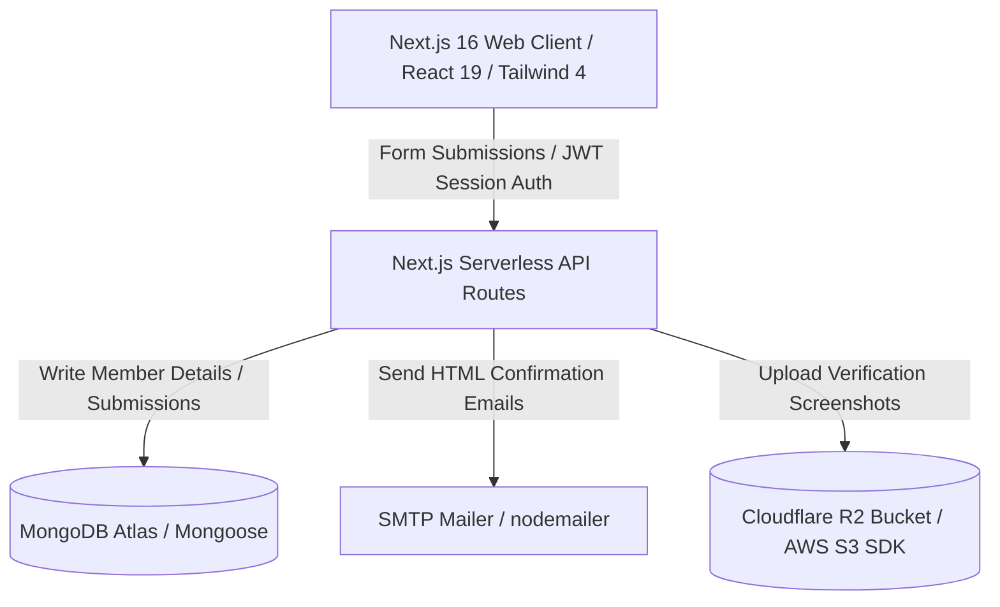

# System Architecture - Cloud Community Club (C³)

This document describes the design patterns, technology choices, and data flow architecture of the C³ platform.

## 1. Technical Stack
- **Framework**: Next.js 16 (App Router)
- **Runtime & Deployment**: Node.js, Vercel Serverless environment
- **Frontend Layer**: React 19, Tailwind CSS 4 (with `@tailwindcss/postcss`), Framer Motion (for transitions), Lucide React, and React Icons.
- **Interactivity & Gamification**: React Typed (typewriter effect), Canvas Confetti, and Use Sound (UX sound effects).
- **Form Management**: React Hook Form with Zod Resolvers.
- **Database & ODM**: MongoDB & Mongoose.

## 2. Database Models (`src/models/`)
All database schemas are built on top of Mongoose with appropriate indexing for queries and dev HMR safeguard checks to prevent model recompilation.

- **Registration2026** (`Registration2026.ts`):
  - Collection: `registrations-2026`
  - Purpose: Captures full member applications.
  - Keys: `name`, `email` (unique, lowercase), `mobile`, `rollNumber`, `department`, `year`, `interests` (defaults to 'Cloud Computing'), `experience` (motivation), `expectations`, `referral`, `emailSent`, `emailSentAt`.
  
- **Recruitment** (`Recruitment.ts`):
  - Collection: `recruitment`
  - Purpose: Tracks coding recruitment assignments and challenge submissions.
  - Keys: `name`, `email` (restricted validator: must end with `sreenidhi.edu.in` or `shu.edu.in`), `mobile`, `passingOutYear`, `problemUnlocked`, `submittedSolution`, `prUrl`, `source`.

- **DigitalIndiaSubmission** (`DigitalIndiaSubmission.ts`) & **DigitalIndiaAccepted** (`DigitalIndiaAccepted.ts`):
  - Collections: `digital_india_ideathon_submissions`, `digital_india_ideathon_accepted`
  - Purpose: Captures details, payment UTR numbers, screenshot URLs, and validation states for the Digital India Ideathon entries.

## 3. Storage & Integration Layers
- **File Storage** (`src/lib/r2.ts`): Uses the `@aws-sdk/client-s3` library configured to interact with a Cloudflare R2 bucket for storing static user-uploaded files, such as payment screenshots.
- **Email Service** (`src/lib/mail.ts`): Integrated with the `nodemailer` library to establish traditional SMTP connections (using `SMTP_HOST`, `SMTP_PORT`, `SMTP_USER`, `SMTP_PASS`), enabling high-quality HTML email templates to be dispatched dynamically during registration, onboarding, and shortlisting states.
- **Authentication**: JWT-based session security using the `jose` library. Authentication uses an HTTP-Only cookie (`c3_admin_session`) with a life cycle of 8 hours, strict same-site configuration, and SSL enforcement.

## 4. Input Validation & Security
- **Schema Validation**: Shared Zod schemas (`src/features/join/api/schema.ts`) are used in both client forms and Next.js route handlers to validate data structure and format.
- **Query Security**: Database queries sanitize inputs utilizing Mongoose query operators (e.g., using `$eq` on queries) to prevent NoSQL injection vectors.
